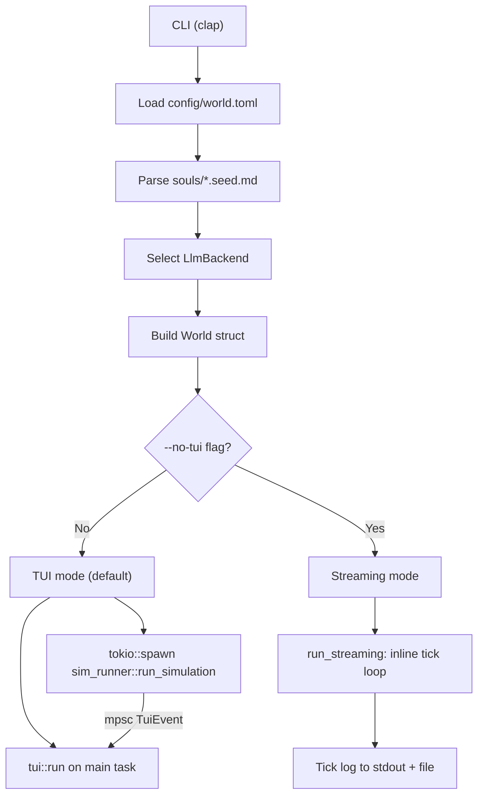
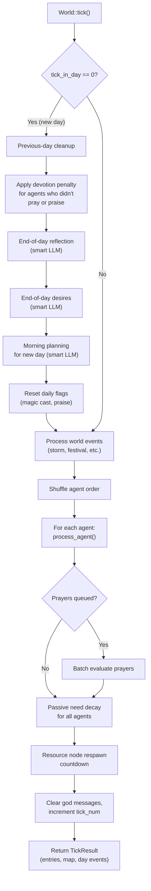
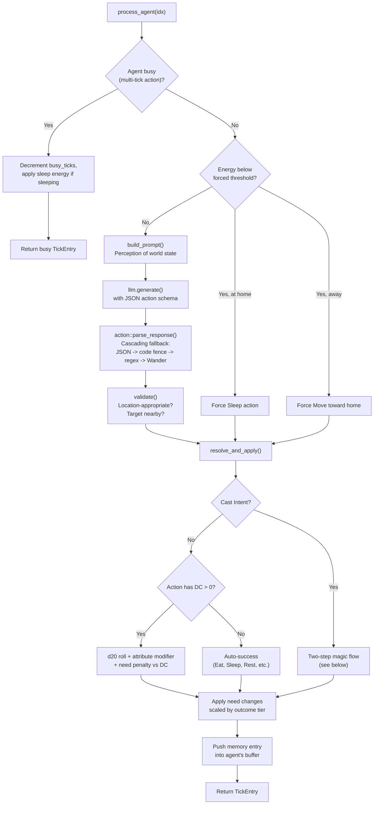
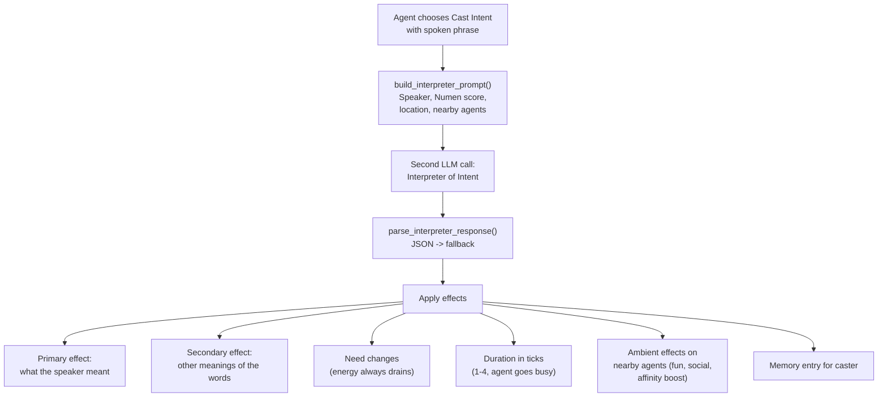

# Simulation Flow

Nephara is a text-based world simulation. AI agents inhabit a shared village, perceive their surroundings each tick, and choose actions driven by needs, personality, and a freeform magic system where spoken intent always succeeds but words carry all their semantic meanings. You don't play a character — you run the simulation and watch emergent stories unfold. For setup instructions see [getting-started.md](getting-started.md); for the full design spec see [spec/world-sim-mvp-spec.md](../spec/world-sim-mvp-spec.md).

This document explains **what happens at runtime** and **where it lives in the code**.

---

## Startup and runtime modes

`main.rs` parses CLI flags, loads `config/world.toml`, parses soul seed files from `souls/*.seed.md`, constructs an `LlmBackend` implementation, and builds the `World` struct. From there, two runtime modes diverge:



**TUI mode** (default) spawns the simulation on a Tokio task and the fullscreen ratatui interface on the main task. They communicate over an `mpsc` channel of `TuiEvent` messages — tick results, map updates, needs snapshots, LLM call records, and day-boundary events. The user can pause, adjust speed, scroll the log, inspect agents, and send "god" messages through the TUI.

**Streaming mode** (`--no-tui`) runs `world.tick()` in a simple loop, printing the tick log to stdout and a file. This is useful for headless runs, piping output, or environments without a capable terminal.

**Key files:** `src/main.rs` (CLI, `run_tui`, `run_streaming`), `src/sim_runner.rs` (`run_simulation`), `src/tui.rs` (ratatui app).

---

## The tick loop

Each call to `World::tick()` advances the simulation by one tick. The tick number maps to in-game time: day = `tick / ticks_per_day + 1`, time of day derived from whether `tick % ticks_per_day` has crossed the configurable `night_start_tick`.



Agents are processed in **shuffled order** each tick — not in a fixed sequence. This prevents positional advantages and contributes to emergent variety.

**Day-boundary calls** happen at the very start of a new in-game day. They use the "smart" LLM backend (a larger model when configured, otherwise the same model) for higher-quality introspective text. These produce `DayEvent` entries that appear in the TUI as morning intentions, evening reflections, and desires.

**Key file:** `src/world.rs` — `World::tick()`, `morning_planning`, `end_of_day_reflection`, `end_of_day_desires`.

---

## One agent's turn

Within each tick, `process_agent` handles a single agent. The flow depends on whether the agent is mid-action, energy-depleted, or free to choose.



**Prompt construction** gives the agent a rich perception of the world: its identity, personality, current needs with severity warnings, recent memories, nearby agents, location description, available actions, daily intentions, affinity toward others, beliefs/rumors, and any pending god messages. The LLM responds with structured JSON constrained by a schema of valid action names.

**Validation** ensures the chosen action makes sense — you can't eat in the forest, you can't chat with someone who isn't nearby, you can't sleep away from home. Invalid actions fall back to a deterministic wander (move to a different location).

**Key files:** `src/world.rs` (`process_agent`, `build_prompt`, `validate`, `resolve_and_apply`), `src/action.rs` (`parse_response`, `resolve`).

---

## Action resolution: the d20 system

Actions fall into two categories: **auto-success** (DC 0) and **skill-checked** (DC > 0). Auto-success actions — Eat, Sleep, Rest, Bathe, Play, Move, Pray, Praise, Meditate — always work but still apply their configured need changes. Skill-checked actions roll a d20:

| Roll component | Source |
|---|---|
| d20 | Random 1–20 |
| Attribute modifier | Agent's governing attribute score minus 5 |
| Need penalty | Penalty when relevant needs are critically low |
| Specialty bonus | +2 when action matches the agent's specialty |
| Extra DC | Storm events raise all DCs by 4 |

**Total = d20 + modifier + penalty + specialty.** Compare against the action's DC (configurable per action in `world.toml`, with a night bonus for Forage and Explore).

| Outcome tier | Condition | Need multiplier |
|---|---|---|
| Critical Fail | Natural 1 | 0.5x |
| Fail | Total < DC | 0.0x |
| Success | Total >= DC | 1.0x |
| Critical Success | Natural 20 | 1.5x |

The multiplier scales how much the action's need changes apply. A failed Forage restores no hunger; a critical success Cook restores 1.5x the normal amount.

**Skill-checked actions and their governing attributes:**

| Action | Attribute |
|---|---|
| Cook | Wit |
| Forage | Grace |
| Fish | Grace |
| Exercise | Vigor |
| Explore | Vigor |
| Chat | Heart |
| Teach | Heart |
| Admire | Heart |

**Key file:** `src/action.rs` (`resolve`, `action_cfg_and_attr`, `OutcomeTier`).

---

## Cast Intent: the magic system

When an agent chooses Cast Intent, the simulation makes **two LLM calls** — one to decide the action (which includes the spoken intent phrase), and a second to interpret what that phrase does to reality.



The Interpreter prompt instructs the LLM to analyze every word for secondary meanings — synonyms, metaphors, etymological echoes. The agent's **Numen** score (1–10) controls how cleanly the intent manifests:

- **Numen 1–3:** Secondary meanings dominate. Reality is creative and willful.
- **Numen 4–6:** Mixed. Primary effect occurs, but secondary meanings also manifest.
- **Numen 7–9:** Clean. Primary dominates, secondary effects are subtle.
- **Numen 10:** Masterful. Almost exactly as intended.

Magic **always succeeds** — there is no d20 roll. Repeated casting within a configurable window costs extra energy (repeat penalty). Nearby agents who witness a cast gain fun and social, and their affinity toward the caster increases.

**Key files:** `src/magic.rs` (`build_interpreter_prompt`, `parse_interpreter_response`), `src/world.rs` (`resolve_cast_intent`).

---

## LLM call taxonomy

The simulation makes several distinct kinds of LLM calls, each tagged for the TUI's debug overlay:

| Kind | When | Backend | Output |
|---|---|---|---|
| `action` | Every non-forced agent turn | Main LLM | Structured JSON (action + reason + description) |
| `cast_intent` | When an agent casts magic | Main LLM | Interpreter JSON (effects, need changes, memory) |
| `chat` | Two agents converse | Main LLM | Conversation summary |
| `planning` | Start of each in-game day | Smart LLM | Morning intention text |
| `reflection` | End of each in-game day | Smart LLM | Life story update |
| `desires` | End of each in-game day | Smart LLM | Wishes and desires |
| `end_of_run` | After final tick | Smart LLM | End-of-run desires |
| `prayer_eval` | Batch, end of tick | Smart LLM | God's evaluation of prayers |

The "smart" LLM is a separate, optionally larger model configured via `smart_model` in `world.toml`. When not configured, all calls go through the same model.

**Fallback parsing** is critical: the simulation must never crash due to malformed LLM output. Every response parser uses cascading fallbacks — JSON, code fence extraction, regex, then a safe default (Wander for actions, a generic fallback for magic interpretation).

**Key file:** `src/llm.rs` (`LlmBackend` trait, `OllamaBackend`, `OpenAICompatBackend`, `ClaudeBackend`, `MockBackend`, `LlmCliBackend`).

---

## Persistence

Each simulation run writes to two locations:

```
runs/<run_id>/
  tick_log.txt       Full tick-by-tick narrative
  trace.log          Tracing output (debug logs)
  state_dump.json    Periodic world state snapshot (overwritten each interval)
  llm_calls/         Per-call prompt/response logs (one file each)
  introspection/     Morning plans, reflections, desires

souls/<name>.journal.md    Append-only chronicle entries after each run
souls/<name>.state.json    Consolidated agent state (story, attributes, XP,
                           affinity, beliefs, inventory)
```

Soul seed files (`souls/*.seed.md`) are **never modified by code** — they are immutable artifacts created during the summoning ritual. Journals are append-only. State files are overwritten each run to reflect the agent's current consolidated state.

**Key file:** `src/log.rs` (run log, tick formatting, journal writing, state dumps).

---

## Start here (for contributors)

The codebase follows a linear data-flow through a small number of modules:

| File | Responsibility |
|---|---|
| `main.rs` | CLI parsing, backend selection, world construction, mode dispatch |
| `config.rs` | TOML deserialization into typed `Config` struct |
| `soul.rs` | Parse soul seed markdown (YAML frontmatter + body sections) |
| `world.rs` | `World` struct, tick loop, prompt building, action resolution, all `resolve_*` methods |
| `action.rs` | `Action` enum, d20 resolution, response parsing with fallbacks |
| `magic.rs` | Interpreter prompt construction and response parsing |
| `agent.rs` | `Agent` struct, needs, attributes, memory buffer, affinity, beliefs |
| `llm.rs` | `LlmBackend` trait + all backend implementations |
| `sim_runner.rs` | Extracted tick loop for TUI mode; sends `TuiEvent` over mpsc |
| `tui.rs` | Fullscreen TUI (ratatui): map, event log, needs bars, debug overlay |
| `tui_event.rs` | Pure data types for TUI events |
| `log.rs` | Tick log formatting, journal writing, state dumps |
| `color.rs` | ANSI and ratatui color mappings |
| `bench.rs` | Benchmark subcommand (`nephara bench`) |

All tunable parameters live in `config/world.toml` — decay rates, DCs, restoration amounts, tick counts, LLM settings. The `MockBackend` returns random valid actions and requires no LLM, network, or GPU, making it the default for tests and first runs.
